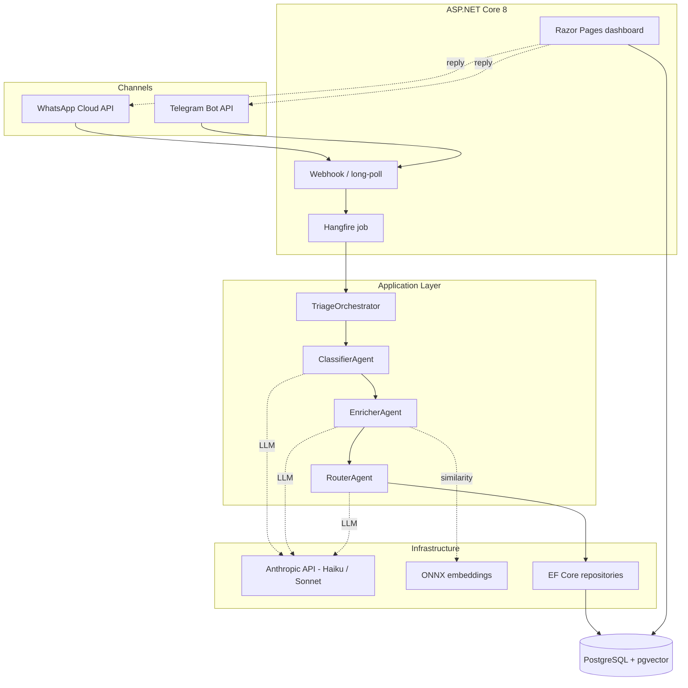
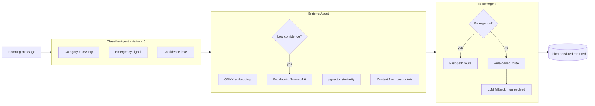
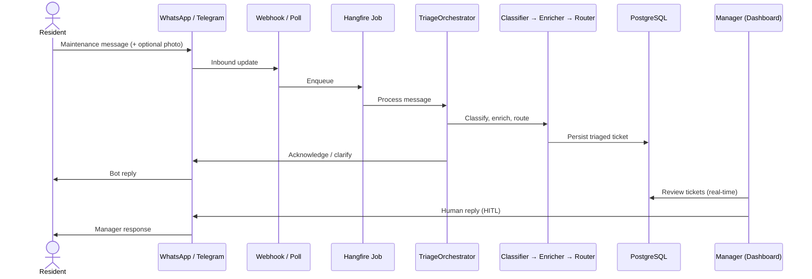
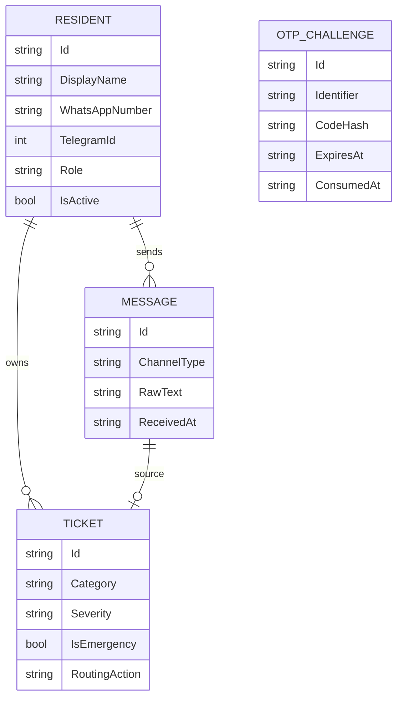

# Hanwas AI

**An agentic maintenance-request triage system for residential buildings, built on .NET 8 and Claude.**

[](https://github.com/arslan-kursad/apartment-triage/actions/workflows/ci.yml)


> CI runs the full suite except tests requiring a live LLM API key (`Smoke`/`Eval` traits),
> which are documented and run locally — see [`.github/workflows/ci.yml`](.github/workflows/ci.yml).
> One test is skipped on purpose: `ec0020` caught a real similarity-signal bug in the
> embedding pipeline, tracked in [ADR-0015](docs/decisions/ADR-0015-enricher-similarity-threshold-blocked-by-tokenizer.md)
> and [issue #5](https://github.com/arslan-kursad/apartment-triage/issues/5) — not silenced, just not re-blocking every push until that's fixed.

---

## Overview

Building managers drown in unstructured maintenance messages — a water leak, a broken
elevator, and a noise complaint all arrive as free-form text across WhatsApp and Telegram,
in mixed languages, with no structure and no prioritization.

Hanwas AI turns that stream into triaged, actionable tickets. An incoming message is
classified, enriched with context from past tickets, and routed — automatically flagging
emergencies and escalating only ambiguous cases to a stronger model. A manager works from a
real-time dashboard instead of a chat backlog.

The system runs in production for a small real building, processing live resident messages.

Want to try it? Message [@HanwasBot](https://t.me/HanwasBot) on Telegram with a maintenance-style
complaint (Turkish or English) and watch it get triaged.

---

## Key Features

- **Multi-agent pipeline** — a custom orchestrator coordinates three specialized agents; no agent framework.
- **Native multi-channel** — WhatsApp Cloud API and Telegram Bot API, integrated directly.
- **Emergency fast-path** — a two-layer architecture guarantees emergencies are never silently downgraded.
- **Image analysis** — residents can attach a photo; it is sent to the vision model as context.
- **Cost-aware model routing** — Haiku 4.5 by default; only low-confidence cases escalate to Sonnet.
- **Semantic similarity** — local ONNX embeddings + pgvector surface related past tickets.
- **Passwordless auth** — channel-native OTP login (the manager triggers `/login` from the bot), role-ready.
- **Human-in-the-loop replies** — managers can respond to residents from the dashboard.
- **Bilingual** — Turkish/English throughout, with autodetection.

---

## Architecture

Four layers with a strict inward dependency flow (`Web → Application + Infrastructure → Domain`).
Infrastructure implements the interfaces the Application layer declares (Dependency Inversion).



---

## Agent Pipeline

Each agent has one responsibility and a typed `IAgent<TIn, TOut>` contract. The orchestrator
runs them in sequence, escalating model strength only when the work warrants it.



---

## Message Flow



---

## Tech Stack

| Area | Choice |
|------|--------|
| Runtime | .NET 8, C# 12 |
| Web | ASP.NET Core 8 Minimal API + Razor Pages, Tailwind CSS |
| AI | Anthropic API (Claude Haiku 4.5 / Sonnet 4.6) via direct `HttpClient` |
| Embeddings | ONNX Runtime, `multilingual-e5-small` (local inference) |
| Data | PostgreSQL 16 + pgvector, EF Core 8, Npgsql |
| Background jobs | Hangfire (PostgreSQL-backed) |
| Channels | WhatsApp Cloud API, Telegram Bot API (both direct) |
| Auth | Cookie authentication, channel-native OTP |
| Logging | Serilog (structured JSON) |
| Testing | xUnit, FluentAssertions, Testcontainers |
| Hosting | Fly.io (Frankfurt), Neon (managed Postgres) |

---

## Data Model



---

## Project Structure

```
src/
  ApartmentTriage.Domain/         Pure entities, enums, value objects
  ApartmentTriage.Application/    Agent abstractions, orchestrator, use cases
  ApartmentTriage.Infrastructure/ EF Core, Anthropic client, channels, ONNX
  ApartmentTriage.Web/            Minimal API + Razor Pages + Hangfire host
tests/
  ApartmentTriage.Tests/          Unit and integration tests
docs/
  decisions/                      Architecture Decision Records
```

The layering is deliberate: the Domain has no dependencies, the Application layer owns the
contracts, and Infrastructure provides the implementations — keeping the LLM, database, and
channel details swappable and the core logic testable in isolation.

---

## Engineering Decisions

Key trade-offs are documented as **14 Architecture Decision Records** in
[`docs/decisions/`](docs/decisions/). A few representative ones:

- [ADR-0001](docs/decisions/ADR-0001-custom-orchestrator-over-semantic-kernel.md) — a ~500-LOC custom orchestrator over a general agent framework, for transparency and control.
- [ADR-0002](docs/decisions/ADR-0002-anthropic-direct-http-over-official-sdk.md) — calling the Anthropic API over direct `HttpClient` instead of an SDK.
- [ADR-0005](docs/decisions/ADR-0005-two-layer-emergency-architecture.md) — a two-layer emergency architecture so a misclassification can never silently drop an emergency.

---

## Getting Started

**Prerequisites:** .NET 8 SDK · PostgreSQL 16 with the `pgvector` extension · the embedding model
(`scripts/download-models.sh`).

```bash
# Configure secrets (user-secrets in dev)
dotnet user-secrets set "ConnectionStrings:Default" "<postgres-connection>"
dotnet user-secrets set "Anthropic:ApiKey"          "<anthropic-key>"
dotnet user-secrets set "TelegramBot:Token"         "<telegram-bot-token>"
dotnet user-secrets set "Embeddings:ModelPath"      "<path-to-onnx-model>"

# Run (migrations apply automatically on startup)
dotnet run --project src/ApartmentTriage.Web
```

```bash
dotnet test    # unit + integration suites
```

---

## Status & Metrics

- **Classification eval** (48 labeled cases): **93.3%** category accuracy, **100%** emergency
  recall, **75%** emergency precision.
- **Production:** live for a small real building, processing real resident messages.
- **Cost:** Neon's Postgres free tier + a single small Fly.io machine (auto-suspended when
  idle); LLM spend is tracked in the dashboard's FinOps view, kept low by the
  Haiku-default / Sonnet-on-escalation routing.

> Metrics are real measurements from the evaluation suite, not projections.
